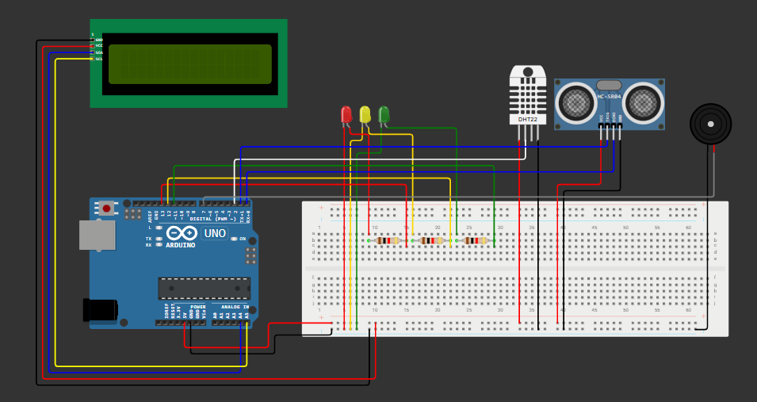
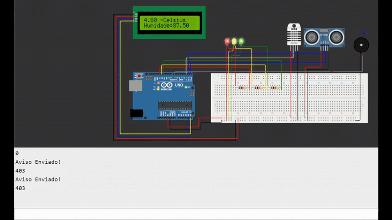
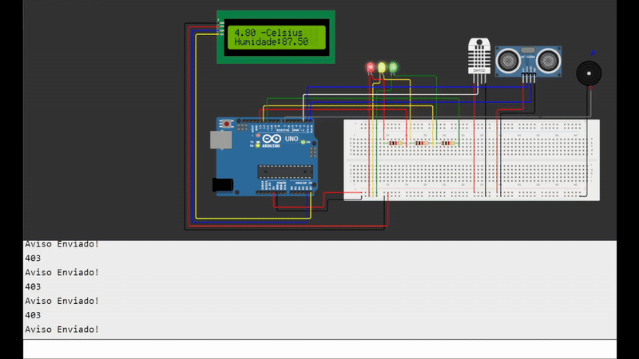

# GS_01_ECCS
Repositório conténdo o código fonte e explicação do projeto feito para a matéria de Edge Computing And Computer Systems.

## Problema
As enchentes afetam milhões de brasileiros todos os anos. Somente entre 1991 e 2022, foram mais de 21 mil casos. Em 2024, o Rio Grande do Sul viveu uma das piores crises, com cidades submersas e centenas de mortos.

Mais do que um fenômeno natural, o problema é agravado pela falta de infraestrutura, planejamento urbano e políticas públicas eficazes. Os prejuízos humanos e econômicos são enormes e evitáveis.

Tecnologia e prevenção são caminhos possíveis. O desafio é transformar alerta em ação.

## Visão geral da solução (com instruções e figuras ilustrativas)

Criando um dispositivo com o Arduino, pegariamos informações como Temperatura, Humidade e nível de água de ruas e lugares com perigo de enchente.

</img>

Utilizando um sensor de temperatura e umidade para pegar informações de risco de chuvas fortes, um sensor de distância ou um sensor de níve de água para medir possíveis enchentes.

Nesse mesmo sistema ativaria um alarme de som para avisar níveis de enchetes perigosas e mandaria tais informações para um banco de dados que alimentaria um site que avisaria ruas com risco ou já sendo afetadas por enchentes.

## Guia para simular o projeto no Wokwi ou Tinkercad
</img>

Após iniciar o simulador é possível ao clicar no sensor de distância e alterar o valor que está sendo devolvido por ele para testar a detecção da profundidade dá água.

</img>

Clicando no sensor de Temperatura e Umidade é possível alterar os valores retornados que seriam mandados para o banco de dados.

## Link do Simulador
<a href = "https://wokwi.com/projects/432412556734678017">Link para o Simulador</a>

## Link vídeo demonstrativo